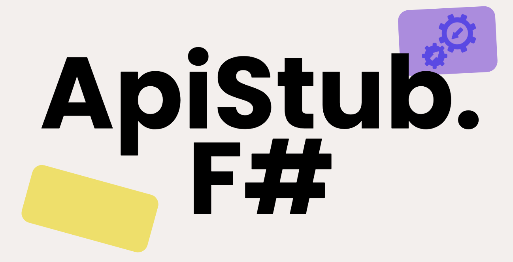

# ApiStub.FSharp [](https://www.nuget.org/packages/ApiStub.FSharp) 🦔



<a href='https://juststopoil.org/' target="_blank"></a>  
[](https://stand-with-ukraine.pp.ua)  
[](https://techforpalestine.org/learn-more)  

## Easy API Testing 🧞‍♀️

This library makes use of [F# computation expressions](https://learn.microsoft.com/en-us/dotnet/fsharp/language-reference/computation-expressions) 🪔✨  to hide some complexity of `WebApplicationFactory` and provide the user with a *domain specific language* (DSL) for integration tests. 

An "antique" C# API (👴🏽🦖🦕) is also available since v.1.1 for enhanced accessibility 😺.

## Documentation

Access the [documentation website](https://jkone27.github.io/fsharp-integration-tests/)  for more info on how to use this library.  

## Scenario


## Test 🧪
  
```fsharp
open ApiStub.FSharp.CE
open ApiStub.FSharp.BuilderExtensions
open ApiStub.FSharp.HttpResponseHelpers
open Xunit

module Tests =

    // build your aspnetcore integration testing CE
    let test = new TestClient<Startup>()

    [<Fact>]
    let ``Calls Hello and returns OK`` () =

        task {

            let client = 
                test { 
                    GETJ "/externalApi" {| Ok = "yeah" |}
                }
                |> _.GetFactory()
                |> _.CreateClient()

            let! r = client.GetAsync("/Hello")

        }
```

### Test .NET C# 🤝 from F#

F# is a great language, but it doesn't have to be scary to try it. Integration and Unit tests are a great way to introduce F# to your team if you are already using .NET or ASPNETCORE. 

In fact you can add an `.fsproj` within a C# aspnetcore solution `.sln`, and just have a single F# assembly test your C# application from F#, referencing a `.csproj` file is easy! just use regular [dotnet add reference command](https://learn.microsoft.com/bs-latn-ba/dotnet/core/tools/dotnet-add-reference).

## How to Contribute ✍️

* Search for an open issue or report one, and check if a similar issue was reported first
* feel free to get in touch, to fork and check out the repo
* test and find use cases for this library, testing in F# is awesome!!!!

## Commit linting 📝

This project uses [Commitlint](https://commitlint.js.org/) npm package and [ConventionalCommits](https://www.conventionalcommits.org/en/v1.0.0/#summary) specification for commits, so be aware to follow them when committing, via [Husky.NET](https://alirezanet.github.io/Husky.Net/guide/getting-started.html#add-your-first-hook)

## Versioning 📚

This repository uses [Versionize](https://github.com/versionize/versionize/blob/master/.github/workflows/publish.yml) as a local dotnet tool to version packages when publishing. **Versionize** relies on [conventional commits](#commit-linting) to work properly.  

### References

* more info on [F# xunit testing](https://learn.microsoft.com/en-us/dotnet/core/testing/unit-testing-fsharp-with-dotnet-test).
* more general info on aspnetcore integration testing if you use [Nunit](https://learn.microsoft.com/en-us/dotnet/core/testing/unit-testing-fsharp-with-nunit) instead.
* [aspnetcore integration testing](https://learn.microsoft.com/en-us/aspnet/core/test/integration-tests?view=aspnetcore-7.0) docs in C#

