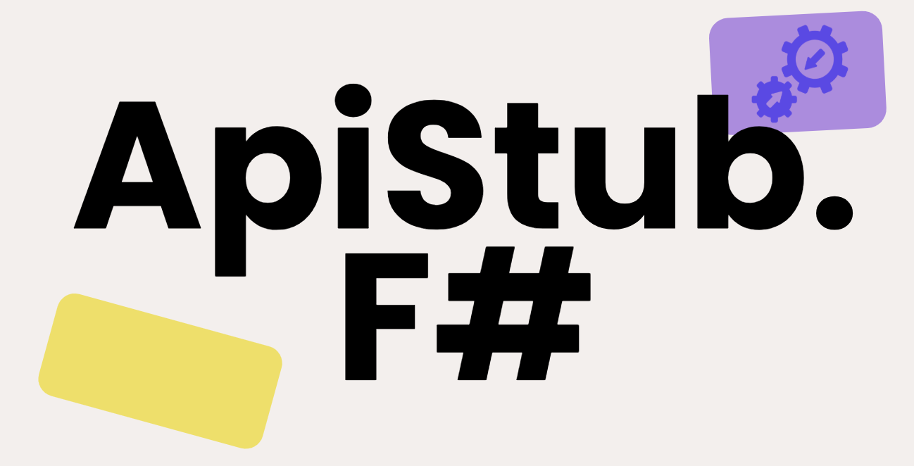

<!-- # ApiStub.FSharp -->



## Easy API Testing 🧞‍♀️

This library makes use of [F# computation expressions](https://learn.microsoft.com/en-us/dotnet/fsharp/language-reference/computation-expressions) or CEs to wrap some complexities of `WebApplicationFactory<T>` when setting up `integration tests` for a `.NET` Web app. It comes with a *domain specific language* (DSL) for "mocking" HttpClient factory in integration tests, and more.

### Test .NET C# 🤝 from F#

F# is a great language, but it doesn't have to be scary to try it. Integration and Unit tests are a great way to introduce F# to your team if you are already using .NET or ASPNETCORE. 

In fact you can add an `.fsproj` within a C# aspnetcore solution `.sln`, and just have a single F# assembly test your C# application from F#, referencing a `.csproj` file is easy! just use regular [dotnet add reference command](https://learn.microsoft.com/bs-latn-ba/dotnet/core/tools/dotnet-add-reference).

## Usage

To use the CE, you must build your CE object first by passing the generic `Program` (minimal api) or `Startup` (mvc) type argument to `TestClient<T>`.

### Sample Use Case

Suppose in your main app (`Program` or `Startup`) you call `Services.AddHttpClient`(or its variants) twice, registering 2 API clients to make calls to other services, say to the outbound routes `/externalApi` and `/anotherApi` (let's skip the base address for now).
suppose `ExternalApiClient` invokes an http `GET` method and the other client makes a `POST` http call, inside your API client code. 

<br>
<div class="mermaid text-center">
sequenceDiagram
    Test->>App: GET /Hello
    App->>ApiDep1: GET /externalApi
    ApiDep1-->>App: Response
    App->>ApiDep2: POST /anotherApi
    ApiDep2-->>App: Response
    App-->>Test: Response
</div>
<br>

### HTTP Mocks 🤡

It's easy to **mock** those http clients dependencies (with data stubs) during integration tests making use of `ApiStub.FSharp` lib, saving quite some code compared to manually implementing the `WebApplicationFactory<T>` pattern, let's see how below.

## F# 🦔 ✨

* `Program`: to be able to make use of `Program.fs` (e.g. minimal api) as `TestClient<Program>()`, make sure to declare an empty `type Program = end class` on top of your Program module containing the `[<EntryPoint>] main args` method.


```fsharp
open ApiStub.FSharp.CE
open ApiStub.FSharp.BuilderExtensions
open ApiStub.FSharp.HttpResponseHelpers
open Xunit

module Tests =

    // build your aspnetcore integration testing CE
    let test = new TestClient<Startup>()

    [<Fact>]
    let ``Calls Hello and returns OK`` () =

        task {

            let testApp =
                test { 
                    GETJ "/externalApi" {| Ok = "yeah" |}
                    POSTJ "/anotherApi" {| Whatever = "yeah" |}
                }

            use client = testApp.GetFactory().CreateClient()

            let! r = client.GetAsync("/Hello")

            r.EnsureSuccessStatusCode()
        } 
```

## C# 🤖 for 👴🏽🦖🦕

if you prefer to use C# for testing, some extension methods are provided to use with C# as well:  

`GETJ, PUTJ, POSTJ, DELETEJ`

If you want to access more overloads, you can access the inspect `TestClient<T>` members and create your custom extension methods easilly.

```csharp
using ApiStub.FSharp;
using static ApiStub.Fsharp.CsharpExtensions; 

var webAppFactory = new CE.TestClient<Web.Sample.Program>()
    .GETJ(Clients.Routes.name, new { Name = "Peter" })
    .GETJ(Clients.Routes.age, new { Age = 100 })
    .GetFactory();

// factory.CreateClient(); // as needed later in your tests

```

## Mechanics 👨🏽‍🔧⚙️

This library makes use of [F# computation expressions](https://learn.microsoft.com/en-us/dotnet/fsharp/language-reference/computation-expressions) to hide some complexity of `WebApplicationFactory` and provide the user with a *domain specific language* (DSL) for integration tests in aspnetcore apps.  

🪆📦 > The main "idea" behind this library is having a CE builder that wraps the creation of a `russian doll` or `chinese boxes` of HttpHandlers to handle mocking requests to http client instances in your application under test or SUT.

The best way to understand how it all works is checking the [code](https://github.com/jkone27/fsharp-integration-tests/blob/249c3244cd7e20e2168b82a49b6e7e14f2ad1004/ApiStub.FSharp/CE.fs#L176) and this member CE method `GetFactory()` in scope.

If you have ideas for improvements feel free to open an issue/discussion! 
I do this on my own time, so support is limited but contributions/PRs are welcome 🙏 

## Features 👨🏻‍🔬

* **HTTP client mock DSL**:
    * supports main HTTP verbs
    * support for JSON payload for automatic object serialization
* **BDD spec dsl extension** (behaviour driven development)
    * to express tests in gherkin GIVEN, WHEN, THEN format if you want to
* EXTRAS
    * utilities for test setup and more...

## HTTP Methods 🚕

Available HTTP methods in the test dsl to "mock" HTTP client responses are the following:

### Basic

* `GET`, `PUT`, `POST`, `DELETE` - for accessing request, route parameters and sending back HttpResponseMessage (e.g. using R_JSON or other constructors)

```fsharp
    // example of control on request and route value dictionary
    PUT "/externalApi" (fun r rvd -> 
        // read request properties or route, but not content...
        // unless you are willing to wait the task explicitly as result
        {| Success = true |} |> R_JSON 
    )
```

### JSON 📒

* `GETJ`, `PUTJ`, `POSTJ`, `DELETEJ` - for objects converted to JSON content

```fsharp
GETJ "/yetAnotherOne" {| Success = true |}
```

### ASYNC Overloads (task) ⚡️

* `GET_ASYNC`, `PUT_ASYNC`, `POST_ASYNC`, `DELETE_ASYNC` - for handling asynchronous requests inside a task computation expression (async/await) and mock dynamically

```fsharp
// example of control on request and route value dictionary
    // asynchronously
    POST_ASYNC "/externalApi" (fun r rvd -> 
        task {
            // read request content and meddle here...
            return {| Success = true |} |> R_JSON 
        }
    )
```

### HTTP response helpers 👨🏽‍🔧

Available HTTP content constructors are: 

* `R_TEXT`: returns plain text
* `R_JSON`: returns JSON
* `R_ERROR`: returns an HTTP error

## Configuration helpers 🪈

* `WITH_SERVICES`: to override your ConfigureServices for tests
* `WITH_TEST_SERVICES`: to override your specific test services (a bit redundant in some cases, depending on the need)

## BDD (gherkin) Extensions 🥒

You can use some BDD extension to perform [Gherkin-like setups and assertions](https://cucumber.io/docs/gherkin/reference/)

they are all async `task` computations so they can be simply chained together:

* `SCENARIO`: takes a `TestClient<TStartup>` as input and needs a name for your test scenario
* `SETUP`: takes a scenario as input and can be used to configure the "test environmenttest": factory and the API client, additionally takes a separate API client configuration
* `GIVEN`: takes a "test environment" or another "given" and returns a "given" step
* `WHEN`: takes a "given" or another "when" step, and returns a a "when" step
* `THEN`: takes a "when" step and asserts on it, returns the same "when" step as result to continue asserts
* `END`: disposes the "test environment" and concludes the task computation

```fsharp
// open ...
open ApiStub.FSharp.BDD
open HttpResponseMessageExtensions

module BDDTests =

    let testce = new TestClient<Startup>()

    [<Fact>]
    let ``when i call /hello i get 'world' back with 200 ok`` () =
            
            let mutable expected = "_"
            let stubData = { Ok = "undefined" }

            // ARRANGE step is divided in CE (arrange client stubs)
            // SETUP: additional factory or service or client configuration
            // and GIVEN the actual arrange for the test 3As.
                
            // setup your test as usual here, test_ce is an instance of TestClient<TStartup>()
            test_ce {
                POSTJ "/another/anotherApi" {| Test = "NOT_USED_VAL" |}
                GET_ASYNC "/externalApi" (fun r _ -> task { 
                    return { stubData with Ok = expected } |> R_JSON 
                })
            }
            |> SCENARIO "when i call /Hello i get 'world' back with 200 ok"
            |> SETUP (fun s -> task {
            
                let test = s.TestClient
                
                // any additiona services or factory configuration before this point
                let f = test.GetFactory() 
                
                return {
                    Client = f.CreateClient()
                    Factory = f
                    Scenario = s
                    FeatureStubData = stubData
                }
            }) (fun c -> c) // configure test client here if needed
            |> GIVEN (fun g -> //ArrangeData
                expected <- "world"
                expected |> Task.FromResult
            )
            |> WHEN (fun g -> task { //ACT and AssertData
                let! (r : HttpResponseMessage) = g.Environment.Client.GetAsync("/Hello")
                return! r.Content.ReadFromJsonAsync<Hello>()

            })
            |> THEN (fun w -> // ASSERT
                Assert.Equal(w.Given.ArrangeData, w.AssertData.Ok) 
            )
            |> END

```


## More Examples?

Please take a look at the examples in the `test` folder for more details on the usage.

## ApiStub.FSharp.Stubbery ⚠️ 🐦

A version using the [Stubbery](https://github.com/markvincze/Stubbery) library is also present for "compatibility" when migrating from `stubbery` versions of pre existing integration tests, in your integration tests setup.

In general, it's advised to not have dependencies or run any in-memory HTTP server if possible, so the minimal version is preferred.

NOTICE ⚠️: Stubbery will not be supported in adding new features or eventually might be not supported at all in the future.

```fsharp
open ApiStub.FSharp.Stubbery.StubberyCE
open ApiStub.FSharp.BuilderExtensions
open ApiStub.FSharp.HttpResponseHelpers
open Xunit

module Tests =

    // build your aspnetcore integration testing CE using Stubbery library
    // for serving HTTP stubs
    let test_stubbery = new TestStubberyClient<Startup>()

    [<Fact>]
    let ``Integration test with stubbery`` () =

        task {

            let testApp =
                test_stubbery { 
                    GET "/externalApi" (fun r args -> expected |> box)
                }

            use client = testApp.GetFactory().CreateClient()

            let! r = client.GetAsync("/Hello")

            r.EnsureSuccessStatusCode()
        } 
```


## How to Contribute ✍️

* Search for an open issue or report one, and check if a similar issue was reported first
* feel free to get in touch, to fork and check out the repo
* test and find use cases for this library, testing in F# is awesome!!!!

### References 📚

* more info on [F# xunit testing](https://learn.microsoft.com/en-us/dotnet/core/testing/unit-testing-fsharp-with-dotnet-test).
* more general info on aspnetcore integration testing if you use [Nunit](https://learn.microsoft.com/en-us/dotnet/core/testing/unit-testing-fsharp-with-nunit) instead.
* [aspnetcore integration testing](https://learn.microsoft.com/en-us/aspnet/core/test/integration-tests?view=aspnetcore-7.0) docs in C#

### if you want to donate

<a href='https://juststopoil.org/' target="_blank"></a>  
[](https://stand-with-ukraine.pp.ua)  
[](https://techforpalestine.org/learn-more)  

